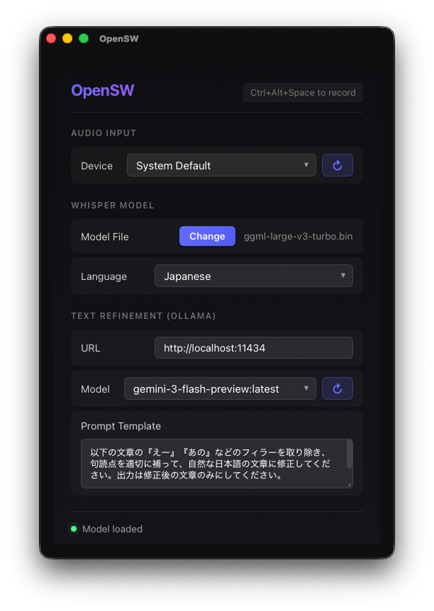
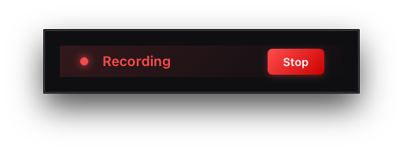
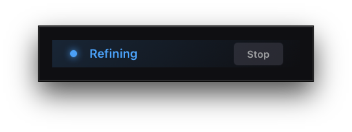

# OpenSW

<div align="center">

**オープンソース音声認識デスクトップアプリケーション**

[English README](./README.md)

[](https://tauri.app/)
[](https://reactjs.org/)
[](https://www.rust-lang.org/)
[](./LICENSE-MIT)

</div>

## 概要

OpenSW は、音声をテキストに変換するためのクロスプラットフォーム対応デスクトップアプリケーションです。[OpenAI Whisper](https://github.com/openai/whisper) を使用してローカルで音声認識を行い、オプションで [Ollama](https://ollama.ai/) と連携して LLM による文章の修正・加工ができます。

### 主な機能

- 🎤 **ローカル音声認識** – Whisper によるオフライン音声認識（クラウド不要）
- ⚡ **GPU アクセラレーション** – Windows では CUDA、macOS では Metal による高速推論
- 🤖 **LLM によるテキスト修正** – Ollama 連携でフィラー除去・句読点補正が可能
- ⌨️ **グローバルショートカット** – どの画面からでも `Ctrl+Alt+Space` で録音開始/停止
- 📋 **自動クリップボードコピー** – 文字起こし結果を自動的にクリップボードにコピー
- 🔔 **システム通知** – 文字起こし完了時に通知
- 📍 **システムトレイ常駐** – バックグラウンドで動作し、トレイアイコンからアクセス可能
- 🖥️ **コンパクト録音モード** – 録音中はミニマルなフローティングウィンドウを表示

## スクリーンショット

### メインウィンドウ



### 録音ワークフロー

|                              録音中                               |                                文字起こし中                                |                              修正中                              |                             コピー完了                             |
| :---------------------------------------------------------------: | :------------------------------------------------------------------------: | :--------------------------------------------------------------: | :----------------------------------------------------------------: |
|  |  |  |  |

## インストール

### 必要環境

- [Bun](https://bun.sh/)（または npm/yarn）
- [Rust](https://www.rust-lang.org/tools/install)（1.70 以上）
- [Whisper GGML モデル](https://huggingface.co/ggerganov/whisper.cpp/tree/main)（tiny, base, small, medium, large のいずれか）

#### プラットフォーム別の要件

**Windows:**

- Visual Studio Build Tools 2019 以上
- CUDA Toolkit（GPU アクセラレーション用、推奨）

**macOS:**

- Xcode Command Line Tools
- Metal は自動的に GPU アクセラレーションに使用されます

**Linux:**

- 標準的な開発ツール（`build-essential` など）
- CUDA Toolkit（GPU アクセラレーション用）

### ソースからビルド

```bash
# リポジトリをクローン
git clone https://github.com/liebe-magi/OpenSW.git
cd OpenSW

# 依存関係をインストール
bun install

# 開発モードで実行
bun run tauri dev

# 本番用ビルド
bun run tauri build

# 本番用ビルド（macOS）
# whisper-rs-sys で CMake エラーが発生する場合は以下を使用：
CMAKE_C_FLAGS="" CMAKE_CXX_FLAGS="" bun run tauri build
```

### Whisper モデルのダウンロード

Whisper GGML モデルを以下からダウンロードしてください：

👉 **https://huggingface.co/ggerganov/whisper.cpp/tree/main**

| モデル                    | サイズ    | 精度 | 速度 |
| ------------------------- | --------- | ---- | ---- |
| `ggml-tiny.bin`           | 約 75 MB  | 低   | 最速 |
| `ggml-base.bin`           | 約 142 MB | 中   | 速い |
| `ggml-small.bin`          | 約 466 MB | 良   | 普通 |
| `ggml-medium.bin`         | 約 1.5 GB | 高   | 遅い |
| `ggml-large-v3-turbo.bin` | 約 1.6 GB | 高   | 普通 |
| `ggml-large-v3.bin`       | 約 3 GB   | 最高 | 最遅 |

> **ヒント**: 日本語の文字起こしには、精度の観点から `ggml-medium.bin` 以上を推奨します。

## 使い方

### クイックスタート

1. **Whisper モデルを選択** – 初回起動時、「Select」をクリックしてダウンロード済みの Whisper GGML モデルファイル（`.bin`）を選択します。

2. **オーディオ入力を設定** – ドロップダウンから使用するマイクを選択します。

3. **録音を開始** – `Ctrl+Alt+Space` を押すか、トレイアイコンをクリックします。

4. **録音を停止** – 再度 `Ctrl+Alt+Space` を押します。音声が文字起こしされ、クリップボードにコピーされます。

### オプション：Ollama 連携

LLM によるテキスト修正を有効にするには：

1. [Ollama](https://ollama.ai/) をインストールして起動
2. モデルをプル（例：`ollama pull llama3.2`）
3. OpenSW で Ollama 設定を構成：
   - **URL**: `http://localhost:11434`（デフォルト）
   - **Model**: インストール済みのモデルを選択
   - **Prompt**: 修正用プロンプトをカスタマイズ

## 設定

すべての設定はローカルに保存され、セッション間で保持されます：

| 設定            | 説明                          |
| --------------- | ----------------------------- |
| Audio Device    | 入力マイクの選択              |
| Whisper Model   | GGML モデルファイルのパス     |
| Language        | 文字起こし言語（日本語/英語） |
| Ollama URL      | Ollama サーバーアドレス       |
| Ollama Model    | テキスト修正用の LLM モデル   |
| Prompt Template | 修正用カスタムプロンプト      |

## 技術スタック

- **フロントエンド**: React 18、TypeScript、Vite
- **バックエンド**: Rust、Tauri 2.0
- **音声認識**: whisper-rs（whisper.cpp バインディング）
- **オーディオ処理**: cpal、hound、rodio
- **LLM 連携**: reqwest 経由の Ollama API

## 開発

### プロジェクト構成

```
OpenSW/
├── src/                    # React フロントエンド
│   ├── components/         # UI コンポーネント
│   └── App.tsx
├── src-tauri/              # Rust バックエンド
│   ├── src/
│   │   ├── main.rs         # アプリケーションエントリポイント
│   │   ├── audio.rs        # 録音/再生
│   │   ├── ollama.rs       # Ollama API クライアント
│   │   ├── clipboard.rs    # クリップボード操作
│   │   └── tray.rs         # システムトレイ設定
│   └── Cargo.toml
└── package.json
```

### コマンド

```bash
# 開発
bun run dev          # Vite 開発サーバー起動
bun run tauri dev    # Tauri を開発モードで実行

# ビルド
bun run build        # フロントエンドビルド
bun run tauri build  # 配布用ビルド

# コード品質
bun run lint         # ESLint 実行
bun run format       # Prettier でフォーマット
```

## コントリビューション

コントリビューションを歓迎します！Issue や Pull Request をお気軽にお寄せください。

## ライセンス

このプロジェクトは以下のいずれかのライセンスの下でデュアルライセンスされています：

- [MIT ライセンス](./LICENSE-MIT)
- [Apache ライセンス 2.0](./LICENSE-APACHE)

お好みに応じてお選びください。

## 謝辞

- [OpenAI Whisper](https://github.com/openai/whisper) – 音声認識モデル
- [whisper.cpp](https://github.com/ggerganov/whisper.cpp) – 軽量 Whisper 実装
- [Tauri](https://tauri.app/) – クロスプラットフォームデスクトップフレームワーク
- [Ollama](https://ollama.ai/) – ローカル LLM ランタイム
