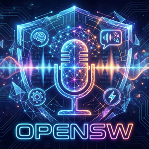

# OpenSW

<div align="center">

**Open-source Speech-to-Text Desktop Application**



[日本語版 README はこちら](./README.ja.md)

[](https://tauri.app/)
[](https://reactjs.org/)
[](https://www.rust-lang.org/)
[](./LICENSE)

</div>

## Overview

OpenSW is a cross-platform desktop application for quick and efficient speech-to-text conversion. It leverages [OpenAI Whisper](https://github.com/openai/whisper) for local transcription and optionally integrates with [Ollama](https://ollama.ai/) to refine transcribed text using LLMs.

### Key Features

- 🎤 **Local Speech Recognition** – Uses Whisper for on-device transcription (no cloud required)
- ⚡ **GPU Acceleration** – CUDA on Windows, Metal on macOS for fast inference
- 🤖 **LLM Text Refinement** – Optional Ollama integration to clean up filler words and improve punctuation
- ⌨️ **Global Shortcut** – Press `Ctrl+Alt+Space` from anywhere to start/stop recording
- 📋 **Auto Clipboard** – Transcribed text is automatically copied to clipboard
- 🔔 **System Notifications** – Get notified when transcription is complete
- 📍 **System Tray** – Runs in background with easy access from tray icon
- 🖥️ **Compact Recording Mode** – Minimal floating window during recording

## Screenshots

<!-- Add screenshots here when available -->

## Installation

### Prerequisites

- [Bun](https://bun.sh/) (or npm/yarn)
- [Rust](https://www.rust-lang.org/tools/install) (1.70+)
- [Whisper GGML Model](https://huggingface.co/ggerganov/whisper.cpp/tree/main) (any size: tiny, base, small, medium, large)

#### Platform-Specific Requirements

**Windows:**

- Visual Studio Build Tools 2019+
- CUDA Toolkit (recommended for GPU acceleration)

**macOS:**

- Xcode Command Line Tools
- Metal is used automatically for GPU acceleration

**Linux:**

- Standard development tools (`build-essential`, etc.)
- CUDA Toolkit (for GPU acceleration)

### Build from Source

```bash
# Clone the repository
git clone https://github.com/liebe-magi/OpenSW.git
cd OpenSW

# Install dependencies
bun install

# Run in development mode
bun run tauri dev

# Build for production
bun run tauri build
```

### Download Whisper Model

Download a Whisper GGML model from:

👉 **https://huggingface.co/ggerganov/whisper.cpp/tree/main**

| Model                     | Size    | Accuracy | Speed    |
| ------------------------- | ------- | -------- | -------- |
| `ggml-tiny.bin`           | ~75 MB  | Low      | Fastest  |
| `ggml-base.bin`           | ~142 MB | Medium   | Fast     |
| `ggml-small.bin`          | ~466 MB | Good     | Moderate |
| `ggml-medium.bin`         | ~1.5 GB | High     | Slow     |
| `ggml-large-v3-turbo.bin` | ~1.6 GB | High     | Moderate |
| `ggml-large-v3.bin`       | ~3 GB   | Highest  | Slowest  |

> **Tip**: For Japanese transcription, `ggml-medium.bin` or larger is recommended for best accuracy.

## Usage

### Quick Start

1. **Select a Whisper model** – On first launch, click "Select" to choose your downloaded Whisper GGML model file (`.bin`).

2. **Configure audio input** – Select your preferred microphone from the dropdown.

3. **Start recording** – Press `Ctrl+Alt+Space` or click the tray icon.

4. **Stop recording** – Press `Ctrl+Alt+Space` again. The audio will be transcribed and copied to your clipboard.

### Optional: Ollama Integration

To enable LLM-based text refinement:

1. Install and run [Ollama](https://ollama.ai/)
2. Pull a model (e.g., `ollama pull llama3.2`)
3. In OpenSW, configure the Ollama settings:
   - **URL**: `http://localhost:11434` (default)
   - **Model**: Select your installed model
   - **Prompt**: Customize the refinement prompt

## Configuration

All settings are stored locally and persist across sessions:

| Setting         | Description                               |
| --------------- | ----------------------------------------- |
| Audio Device    | Select input microphone                   |
| Whisper Model   | Path to GGML model file                   |
| Language        | Transcription language (Japanese/English) |
| Ollama URL      | Ollama server address                     |
| Ollama Model    | LLM model for text refinement             |
| Prompt Template | Custom prompt for refinement              |

## Tech Stack

- **Frontend**: React 18, TypeScript, Vite
- **Backend**: Rust, Tauri 2.0
- **Speech Recognition**: whisper-rs (whisper.cpp bindings)
- **Audio**: cpal, hound, rodio
- **LLM Integration**: Ollama API via reqwest

## Development

### Project Structure

```
OpenSW/
├── src/                    # React frontend
│   ├── components/         # UI components
│   └── App.tsx
├── src-tauri/              # Rust backend
│   ├── src/
│   │   ├── main.rs         # Application entry point
│   │   ├── audio.rs        # Audio recording/playback
│   │   ├── ollama.rs       # Ollama API client
│   │   ├── clipboard.rs    # Clipboard operations
│   │   └── tray.rs         # System tray setup
│   └── Cargo.toml
└── package.json
```

### Commands

```bash
# Development
bun run dev          # Start Vite dev server
bun run tauri dev    # Run Tauri in development mode

# Build
bun run build        # Build frontend
bun run tauri build  # Build distributable

# Code Quality
bun run lint         # Run ESLint
bun run format       # Format with Prettier
```

## Contributing

Contributions are welcome! Please feel free to submit issues and pull requests.

## License

This project is open source under the MIT License.

## Acknowledgments

- [OpenAI Whisper](https://github.com/openai/whisper) – Speech recognition model
- [whisper.cpp](https://github.com/ggerganov/whisper.cpp) – Lightweight Whisper implementation
- [Tauri](https://tauri.app/) – Cross-platform desktop framework
- [Ollama](https://ollama.ai/) – Local LLM runtime
