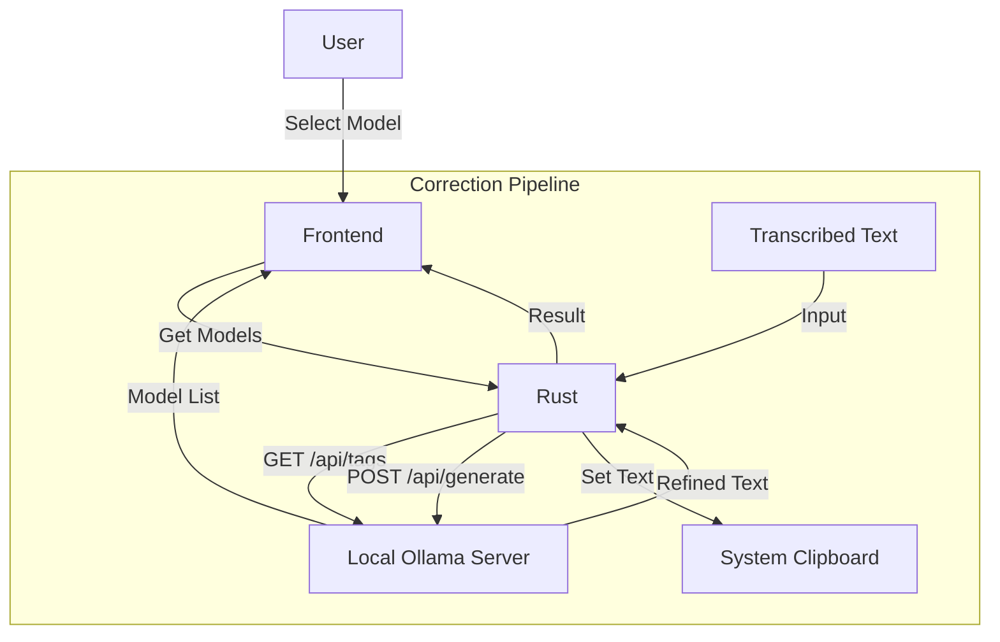

# Design: Ollama & Clipboard Integration

## Architecture

The system follows a "Rust-as-Proxy" pattern to handle external system interactions (Ollama, Clipboard), keeping the Frontend focused on UI/UX.

## Technical Decisions

### 1. HTTP Client: `reqwest`

- **Why**: Standard Rust HTTP client, robust, supports async (compatible with Tauri).
- **Usage**: Used to communicate with the local Ollama instance (`localhost:11434`).
- **Alternative**: Calling `curl` or `ollama` CLI.
  - _Rejection Reason_: Direct API calls via `reqwest` are more performant and easier to handle errors/parsing than spawning shell processes.

### 2. Clipboard: `arboard`

- **Why**: Cross-platform, simple API, actively maintained.
- **Usage**: To write the refined text to the OS clipboard.
- **Alternative**: `clipboard-win` or Tauri's built-in clipboard API (if available/sufficient).
  - _Reasoning_: `arboard` is a common standard in Rust ecosystem. (Note: Tauri v1 has clipboard plugin, but using a crate in backend gives us more control if needed, though Tauri's API is also a valid choice. The user specified `arboard` in requirements, so we stick to that).

### 3. Model Selection

- **Strategy**: Dynamic fetching.
- **Why**: Users may have different models installed (`llama3`, `mistral`, `gemma`). Hardcoding limits usability.
- **Fallback**: If connection fails, show error and retry button.

### 4. Prompt Engineering

- **Default Template**:
  > "以下の文章の『えー』『あの』などのフィラーを取り除き、句読点を適切に補って、自然な日本語の文章に修正してください。出力は修正後の文章のみにしてください。\n\n対象の文章: {text}"
- **Customization**: Users can edit this template in the UI. The `{text}` placeholder is mandatory.
- **Constraint**: `stream: false` to simplify handling (wait for full response).
